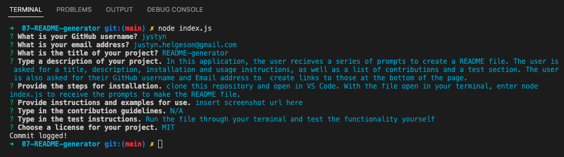

  # README-generator

  

  ## Description

  In this application, the user recieves a series of prompts to create a README file. The user is asked for a title, description, installation and usage instructions, as well as a list of contributions and a test section. The user is also asked for their GitHub username and Email address to  create links to those at the bottom of the page.

  ## Table of Contents

  -- [Installation](#Installation)

  -- [Usage](#Usage)

  -- [Contribution](#Contributing)

  -- [Test](#Test)

  -- [License](#License)

  ## Installation

  clone this repository and open in VS Code. With the file open in your terminal, enter node index.js to receive the prompts to make the README file.

  ## Usage

  
  [Demo](https://drive.google.com/file/d/1ZoxOXcg0whqYLVceZAtBcLbHg3SSsKf2/view)

  ## Contributing

  N/A

  ## Test

  Run the file through your terminal and test the functionality yourself

  ## License

  (https://opensource.org/licenses/MIT)

  This application is licensed under The MIT License

  ## Questions

  [GitHub](https:github.com/jystyn)

  [E-Mail](mailto:justyn.helgeson@gmail.com)

